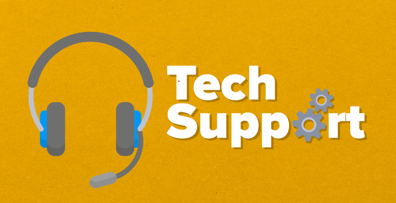

# Unit 20: Managing and Supporting Systems

## Introduction

### What is Tech Support?

Technical or tech support is a customer communication that companies use to help their users with any issues they are having with a product or service.

Typically this is done by using live chat, email or a phone. The aim is to solve technical problems like installations, issues with logins or other technical difficulties that can harm the user experience. 

### There is a difference between tech support and customer support. 

Most people when they hear the term "tech support" imagine call centres dealing with customers that are having some issues but this is not what tech support means. 

Tech support teams are responsible for handling any installation errors, issues and any other technical problem that is making the user experience bad. 

## P1. Explain the activities involved in IT system management and support. 

In the workspace of its systems management and support, tech support performs quite a few activities to make sure smooth functioning of technology infrastructure and to assist users with any technical issues they may encounter. 

The range of activities are: 

+ **Troubleshooting** - This is diagnosing and resolving hardware, software or network-related issues faced by users. This involves identifying the root cause of a problem, following a systematic approach to address the issue and implementing a solution.

+ **Installation** - Many times, customers can have issues with the installation of a software application, and setting up and configuring hardware devices. This may involve installing necessary drivers, configuring network settings, or customizing user preferences.

+ **Software and Hardware Updates** - Regularly updating and maintaining software, firmware, and hardware components to make sure the systems are up-to-date, secure, and operating efficiently.

+ **Network Support** - Tech support is responsible for monitoring, maintaining, and troubleshooting network infrastructure, such as routers, switches, firewalls, and other networking devices.

+ **User Training** - They also provide training and guidance to users on the correct use of hardware and software, including new technologies and systems. 

+ **Security and Data Protection** - Implementation and maintenance of security measures to protect the IT systems and data from unauthorized access, data breaches and other cyber threats.

+ **Backup and Recovery** - Making sure that data is backed up and can be restored in event of failure, data loss or disaster. 

+ **Performance Monitoring** - Technical support continuously monitors the performance of IT systems to identify any potential capacity issues and other things that might affect the system's stability and performance. 

## P2. Explain the tools and systems that can be used to assist with IT system management and support activities.

+ **Remote desktop** - These tools can be TeamViewer, AnyDesk or Microsoft Desktop. These tools enable tech support to remotely access and control a user's computer to diagnose and resolve issues.

+ **Ticketing systems** - Tech support uses ticketing systems, like Jira Service Management, Zendesk, or ServiceNow, to manage and track user-reported issues, assign tasks to team members, and document resolutions.

+ **Monitoring tools** - Monitoring tools can be Nagios, Zabbix, or PRTG, they help the teams to keep an eye on the performance and health of IT systems and infrastructure, they do that by providing alerts when issues result and offer insights into potential problems. 
  

+ **Network management** - SolarWinds, Cisco DNA Center, or Paessler PRTG Network Monitor manage, monitor and troubleshoot network devices making sure optimal performance and security.

+ **Configuration** - Ansible, Puppet, or Chef are tools of configuration management tools that help IT professionals to automate the process of configuring deploying and managing software and hardware across multiple systems. 

+ **Antivirus scans** - Maintaining the protection and stability of computer systems, networks, and data requires regular antivirus scans. They entail using security software to scan applications, files, and other computer parts for malware, such as viruses, worms, ransomware, trojans, and other potentially harmful programs.

## M1 Justify the use of activities and tools to manage and support an IT system.

### Activities:

#### **Troubleshooting** 

+ Why - They do troubleshooting to identify and resolve any hardware, software and network issues that can impact the system's performance, stability or user experience.

+ How - They do it by following a systematic approach to diagnosing problems, which can include gathering information, replicating the issue or identifying the root cause and then implementing a solution. After that, they do some testing to make sure the issue is resolved. 

#### **Installation** 

+ Why - Tech support do this to configure hardware devices, software application and operating systems according to user needs and company requirements making sure compatibility and optimal performance.

+ How - They install necessary drivers, customize settings, configure network connections, and test the installed components to make sure proper functionality.

#### **Software and Hardware Updates**  

+ Why - They do it to maintain security, stability, and performance by making sure that software, firmware, and hardware components are up-to-date and compatible.

+ How - Tech support monitors for updates, applies patches, upgrades software, and replaces outdated hardware components as needed. They also test the systems after updates to make sure compatibility and functionality.

#### **Network Support** 

+ Why - To maintain a stable and secure network infrastructure, making sure optimal performance and preventing downtime or connectivity issues.

+ How - Tech support monitors, troubleshoots, and maintains network devices, such as routers, switches, and firewalls, addressing any performance or security issues that may result.

#### **User Training** 

+ Why - To train users with the necessary knowledge and skills to use IT systems effectively, minimizing the need for support and reducing the risk of user-generated issues.

+ How - Tech support develops training materials, and provides one-on-one assistance, educating users on proper hardware and software usage, new technologies, and best practices.

#### **Security and Data Protection**

+ Why - To make sure that the IT systems and sensitive data are safe from unauthorized access, data breaches and any other cyber threats.

+ How - Tech support implements and maintains security measures like antivirus software, firewalls, software updates and detection systems. 

#### **Backup and Recovery**

+ Why - To make sure that the availability and integrity of critical data, minimise the risk of data loss and enable a swift recovery in the event of a system failure or disaster.

+ How - Tech support sets up and maintains backup systems, verifies the integrity of backups, and manages the recovery process when needed.

#### **Performance Monitoring** 

+ Why - To continuously assess the performance of IT systems, identifying and addressing potential bottlenecks, capacity issues, and other factors that may impact system stability and performance.

+ How - Tech support uses monitoring tools to track system performance metrics, analyzes the data to detect trends or anomalies, and takes proactive measures to optimize and maintain system performance.

### Tools:  

#### **Remote desktop** 
+ Why - Remote desktop allows the tech support team to assist users regardless of their physical location, they do not have to take their device and give it to a person if there is any software issue. The remote desktop enables faster issue resolution, minimizes disruptions, and enhances the overall experience for users. 

+ How - The tech support use tools like TeamViewer or AnyDesk to remotely access and control a user's computer. They can diagnose and resolve issues on the user's system without them being physically present. 

#### **Ticketing systems** - 

+ Why - Ticketing systems are pretty famous in the tech support world. The ticketing systems are essential for managing, prioritizing and tracking user-reported issues and requests. They can help tech support teams stay organized and keep track of the users that have issues with their system. In the ticketing system, there can be a lot of information that can be gathered to help the tech support, the information can be location, time of availability and such. 
  
+ How - They use platforms like Jira Service Management, Zendesk, or ServiceNow to log user-reported issues, categorize and prioritize them, and assign tasks to appropriate team members. They can also track the progress of each ticket, document resolutions, and generate reports for analysis.

#### **Monitoring tools** -  

+ Why -  Monitoring tools are crucial for proactively detecting and addressing potential issues in IT systems. They help Tech Support make sure of good performance, minimize downtime, and maintain the stability of systems by providing real-time insights.
+ How -  Tech Support deploy monitoring solutions such as Nagios, Zabbix, or PRTG to keep track of various performance metrics and the overall health of IT systems.
  

#### **Network management** - 

+ Why - Network management tools are necessary for overseeing the performance, security, and reliability of network infrastructure. By using these tools, tech support teams can effectively troubleshoot network issues, optimize performance, and maintain the overall health of the network.
+ How - Tech support professionals use network management tools like SolarWinds, Cisco DNA Center, or Paessler PRTG Network Monitor to manage, monitor, and troubleshoot network devices and infrastructure. These tools provide real-time visibility into network performance, connectivity, and security, allowing for prompt issue resolution.

#### **Configuration tools** -

+ Why - Configuration management tools are vital for automating the deployment, management, and maintenance of software and hardware across multiple systems. These tools help IT professionals make sure that systems are consistently and correctly configured, enhancing stability, security, and efficiency.

+ How - Tech support leverage configuration management tools such as Ansible, Puppet, or Chef to automate the process of deploying, configuring, and managing software and hardware across multiple systems. These tools help maintain consistent configurations and streamline system management tasks.

Information from:

[Refrence 1](https://www.electric.ai/blog/what-is-it-support)

[Refrence 2](https://www.cio.com/article/234559/8-tech-support-best-practices.html)

[Refrence 3](https://www.ibm.com/uk-en/topics/it-management)

## D1 Evaluate the different activities and tools used to manage and support an IT system, reflecting on their impact on the security, usability and performance of the system.

### Activities
Each of the activities plays a significant role in the tech support world. But sometimes these activities might come with importance, benefits and challenges.

1. Troubleshooting

    Importance: Troubleshooting is an activity that is used for diagnosing and resolving issues that users may encounter with their hardware, software, and network components.

    Benefits: The benefits of effective troubleshooting include increased user satisfaction, reduced downtime, and improved system stability and productivity.

    Challenges: The challenges with troubleshooting can be the complexity of issues, the need for specialized knowledge, and staying updated with the ever-evolving technology landscape.

2. Installation

    Importance: Installation and configuration of hardware and software are critical activities, as they make sure that systems are set up correctly and according to user requirements.

    Benefits: Proper installation contributes to efficient system performance and reduced risk of issues down the line.

    Challenges: The challenges are making sure everything works together, setting up things correctly, and having good instructions.
   

3. Software and Hardware Updates

    Importance: Software and hardware updates are essential for maintaining secure and efficient IT systems

    Benefits: Updates can add new features, make things work better, and fix security problems. 

    Challenges: The challenges are making sure updates work with what you have, planning updates to avoid problems, and knowing when new updates come out.

4. Network Support

    Importance: Network support is important for keeping IT systems working well and also for maintaining a robust and reliable IT infrastructure.

    Benefits: Effective network support can prevent data loss, make sure business continuity, and maintain optimal network performance. 

    Challenges: However, challenges in network support can include monitoring and managing a growing number of network devices, dealing with ever-increasing network traffic, and maintaining network security

5. User Training

    Importance: User training teaches people how to use IT systems.

    Benefits: It can lead to increased productivity, fewer support requests, and better user satisfaction. 

    Challenges: The challenges are teaching people as technology changes, meeting different learning needs, and knowing if the training works.

6. Security and Data Protection

    Importance: Security and data protection keep important information safe and data handled.

    Benefits: good security can protect a personal machine from getting viruses to big companies protecting the sensitive information of customers.

    Challenges: The challenges are staying ahead of new threats, managing many security tools, and meeting different security requirements.

7. Backup and Recovery

    Importance: Regular backups cannot be overstated, as they allow organizations to recover and restore data in the event of system failures, hardware malfunctions, or disasters like fires and floods.

    Benefits:  The benefits of effective backup and recovery strategies include reduced downtime, increased data integrity, and the ability to maintain business continuity in the face of unexpected events.

    Challenges: Challenges may be the need for sufficient storage capacity, the complexity of managing backups across multiple systems and locations, and the requirement to test and validate backups to ensure their usability during a recovery process. 

8.  Performance Monitoring

    Importance: Regularly monitoring the performance of IT systems and infrastructure helps IT teams identify potential issues before they escalate, ensuring that systems are running optimally and efficiently

    Benefits: The benefits of effective performance monitoring include the ability to proactively address potential bottlenecks, capacity issues, and other factors that could impact system stability or performance. This, in turn, leads to improved user experience, increased system reliability, and a reduced likelihood of unexpected downtime.

    Challenges: One such challenge is the need to identify the most relevant metrics and key performance indicators (KPIs) to monitor, as well as setting appropriate thresholds for alerts and notifications. 

### Tools

1. Troubleshooting

    Importance: Troubleshooting is that it helps diagnose and resolve technical issues in the IT systems. If done correctly it makes sure a smooth experience and reduces system downtime.

    Benefits: Troubleshooting can increase productivity, it will reduce downtime and improve user satisfaction.

    Challenges: Troubleshooting can be time-consuming and may require specialized skills to identify and resolve complex issues. 

2. Remote Desktop
    
    Importance: Remote desktop tools are essential for providing remote support to users, enabling IT professionals to access and control user devices without needing to be physically present.
    
    Benefits: These tools save time, reduce travel expenses, and allow for faster issue resolution, resulting in higher user satisfaction and productivity.

    Challenges: Security and privacy concerns may result when using remote desktop tools, and adequate measures must be taken to make sure the safe and secure handling of sensitive data. 

3. Ticketing Systems

    Importance: Ticketing systems help Tech support manage, prioritize, and track user-reported issues effectively.

    Benefits: These systems improve the efficiency of Tech support, making sure that issues are addressed on time and allowing for better communication with users.

    Challenges: Implementing and managing a ticketing system requires an investment in training and ongoing maintenance. Additionally, user adoption and effective categorization of issues can be challenging.
   

4. Monitoring tools

    Importance: Monitoring tools are vital for keeping an eye on the performance, health, and security of IT systems and infrastructure.

    Benefits: These tools provide early warning of potential issues, help identify areas for improvement, and make sure that systems are running optimally.

    Challenges: Monitoring tools can generate large amounts of data that need to be analysed and acted upon. Setting up and configuring monitoring tools can also be complex, requiring specialized knowledge.
   

5. Network Management

    Importance: Effective network management is essential for maintaining a stable and secure IT infrastructure, making sure optimal performance and data flow.

    Benefits: Proper network management can lead to improved network performance, reduced downtime, and enhanced security.

    Challenges: Network management can be complex, requiring specialized skills and knowledge of various networking devices and protocols. It can also be time-consuming, as it involves continuous monitoring and maintenance.

6. Configuration Management

    Importance: Configuration management helps IT professionals automate the deployment, configuration, and management of software and hardware across multiple systems, making sure consistency and compliance.

    Benefits: Effective configuration management can improve efficiency, reduce human error, and simplify the process of maintaining and updating IT systems.

    Challenges: Implementing and maintaining a configuration management system can be complex and require an investment in training and specialized tools. Additionally, managing configuration changes across diverse environments can be challenging. 

---
###### Unit 20: Managing and Supporting Systems